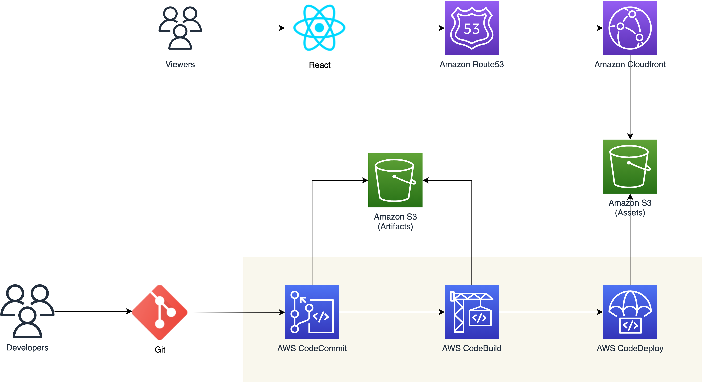

## Deploy React App to S3 Bucket with AWS Code Pipeline CI/CD

*Solutions Architect: gaowexu*

## Contents
* [Introduction](#Introduction)
* [Architecture](#Architecture)
* [Deployment](#Deployment)
* [Usage](#Usage)
* [License](#License)

**Reference**:
- Youtube Video: https://www.youtube.com/watch?v=Mgs7jl430vs
- How to generate github oauth token: https://docs.aws.amazon.com/codepipeline/latest/userguide/appendix-github-oauth.html#GitHub-create-personal-token-CLI
- CDK docs: https://docs.aws.amazon.com/cdk/api/latest/docs/aws-codepipeline-readme.html


#### Introduction
This solution builds a simple React application with AWS Codepipeline CI/CD. Once developers commit to github repo,
it will trigger code commit via webhook and further invoke the code build project, in which the installation and compiling
work will be done. Finally, a S3DeployAction is used to push the React build files to S3 bucket, which is the asset of 
frontend website.


#### Architecture



#### Deployment
##### Step 1: install awscli, git
```angular2html
sudo apt-get install -y awscli git
```

##### Step 2: configure aws account, which is shown below: 
```angular2html
ubuntu@ip-172-31-16-248:~$ aws configure
AWS Access Key ID [None]: AKIAXKJO247JFXXXXXXXX
AWS Secret Access Key [None]: lRk3GTxx0VYXXXXXXXXXyGhtZ30XXXXXXXXXX
Default region name [None]: us-east-1
Default output format [None]: json
```

##### Step 3: install node environment:
```angular2html
sudo apt-get update
sudo apt-get -y upgrade
curl -fsSL https://deb.nodesource.com/setup_16.x | sudo bash -
sudo apt-get install -y nodejs
```

##### Step 4: Github OAuthToken Configuration

##### Step 5: deploy the CI/CD solution:
```angular2html
git clone https://github.com/gaowexu/profile.git
cd profile/service
npm install

// configure parameters: githubTokenName/githubAccount/repoName/branchName

npm run cdk deploy
```


#### Usage
##### Step 1: Configuration of Cloudfront


##### Step 2: Configuration of Route53


##### Step 3: Commit & Test


#### License


